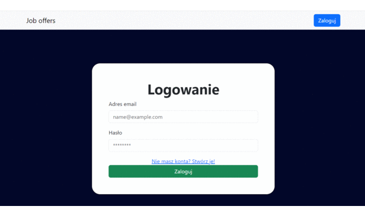

# JobOffers
The Application That Allows People To Explore Job Offers

# Overview

    

## Swagger

    

    

## Front End
 Before run backend in for example InteliJ
 `npm start`

Runs the app in the development mode.\
Open [http://localhost:3000](http://localhost:3000) to view it in your browser.

The page will reload when you make changes.\
You may also see any lint errors in the console.

## Database

    

### Reference Documentation

For further reference, please consider the following sections:

* [Official Apache Maven documentation](https://maven.apache.org/guides/index.html)
* [Spring Boot Maven Plugin Reference Guide](https://docs.spring.io/spring-boot/docs/3.2.2/maven-plugin/reference/html/)
* [Create an OCI image](https://docs.spring.io/spring-boot/docs/3.2.2/maven-plugin/reference/html/#build-image)
* [Spring Data JPA](https://docs.spring.io/spring-boot/docs/3.2.2/reference/htmlsingle/index.html#data.sql.jpa-and-spring-data)
* [Spring Security](https://docs.spring.io/spring-boot/docs/3.2.2/reference/htmlsingle/index.html#web.security)
* [Validation](https://docs.spring.io/spring-boot/docs/3.2.2/reference/htmlsingle/index.html#io.validation)
* [Spring Web](https://docs.spring.io/spring-boot/docs/3.2.2/reference/htmlsingle/index.html#web)

### Guides

The following guides illustrate how to use some features concretely:

* [Accessing Data with JPA](https://spring.io/guides/gs/accessing-data-jpa/)
* [Securing a Web Application](https://spring.io/guides/gs/securing-web/)
* [Spring Boot and OAuth2](https://spring.io/guides/tutorials/spring-boot-oauth2/)
* [Authenticating a User with LDAP](https://spring.io/guides/gs/authenticating-ldap/)
* [Validation](https://spring.io/guides/gs/validating-form-input/)
* [Building a RESTful Web Service](https://spring.io/guides/gs/rest-service/)
* [Serving Web Content with Spring MVC](https://spring.io/guides/gs/serving-web-content/)
* [Building REST services with Spring](https://spring.io/guides/tutorials/rest/)

